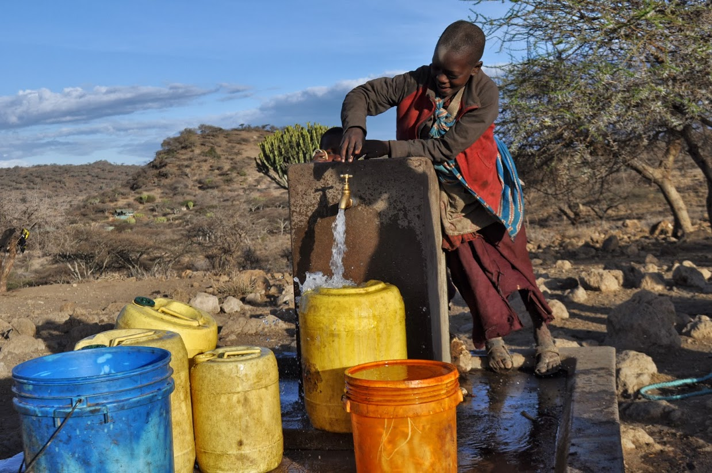

# PREDICTING THE CONDITION OF WATER PUMPS IN TANZANIA



# *Business Understanding*

### The Problem

Tanzania is a developing country in eastern Africa. It is a geographically diverse country with mountainous terrain and flat plains. The country borders the Indian Ocean in the east, and the Great Rift Valley on its western border. A good portion of the country is below sea level, and much of it is 900 ft above sea level. Access to natural resources is spotty, and water is one of the most, if not the most, scarce resource in the country. Many organizations have installed water pumps in villages around the country in an effort to provide clean drinking water to the poeple. These pumps vary in how they extract water, the water quality, and what basin the water comes from, how they are managed, the population around the well, and whether the users have to pay for water or not. Pumps break down regularly and require maintenance which can be quite a task considering there are over 59,000 pumps in the country.

### The Task
We have been asked by the Tanzanian Government to create a predicition model that will predict the condition of a water pump; functional, or non-functional. This will allow them to strategically mobilize repair teams in areas with a high concentration of non-functional pumps, and to efficiently react when resources are needed in a particular area, such as supplying potable water to a village whose pump is non-functional and awaiting repair.

# *Hypothesis*

#### Our null hypothesis is that we CANNOT predict whether a well is functional or not.

#### Our alternative hypothesis is that we CAN predict the condition of a well.

> - A false positive would be to predict a well is non-functional when it is functional.   
> - A false negative would be to predict a well is functional when it is not functional.

# *Data Understanding*

The dataset is provided by Taarifa which aggregates data from the Tanzania Ministry of Water on the over 59,000 water pumps in he country. The data contains information about the location, operation, management, installation, water quality, and population of users of a particular well.

## Method:
- Determine relevant features for prediction
- Create several models and look for best predictor metrics
- Use validation methods to ensure performance
- Tune final model for optimal predictions

## Model Selection

NOTE: a positive prediction is a well that is non-functional. 

#### Maximize Recall
We are seeking a model that will primarily maximize Recall. Recall will measure how well we are predicting wells that are actually non-functional. It is calculated by dividing the number of non-funtioning wells that were correctly predicted by the total number of non-funtional wells in our test set. Recall does not account for false positives.

> Recall:
> - Minimize false negatives
> - Resources are directed to the people who need them 
> - More human lives are saved

With human lives at stake and counting on our model to get it right we will place primary importance on the recall score.

#### Maximize Precision
Secondarily we will be seeking a model that will maximize precision, but not at the expense of recall. Precision is a measure of how accurate the positive predictions are. It is calculated by dividing the number of correctly predicted positives by the total number of positive predictions. Precision does not account for false negatives.

> Precision:
> - Minimize false positives
> - Resources are not directed where they are not needed
> - Less logistic strain on the system, resources and man power

Repair materials and man power are also a scarce resource in this problem ad we cannot afford to be sending repair crews out to wells that have been predicted as non-functional but are functional. However, human life is tantamount and we will not sacrifice recall for more precision.

#### The two metrics have an inverse relationship and it will be tricky to design a model that will maximize both.

# Based on Recall and Precision scores, our best performing model was the *K Nearest Neighbor model*

> Precision: 0.7813137494900041    
> Recall: 0.7393822393822393


# *Reccomendations*

- Track seasonal droughts, water conditions and basin levels so we will know what non-functional pumps are un-repairable to better target efforts
- Install more pumps
- Gather more data

# *Next Steps*
- Gather more data
- Re-assess features for significance
- Further tune the model
- Assess more advanced and resource intensive models

```
├── Data                                       #datasets and visuals used in project
├── README.md                                  #the top-level README for reviewers of this project
├── Tanzania Water Pump Project.ipynb          #regression models
├── Geo_parsing.ipynb                          #methodology used for geolocating coordinates
└── Presentation.pdf                           #non-technical stakeholder presentation slides
```
